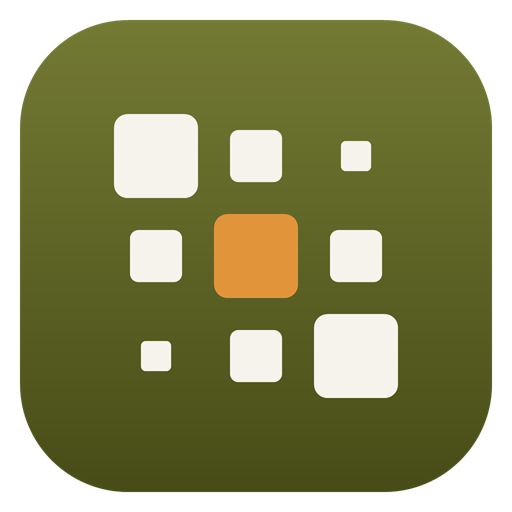
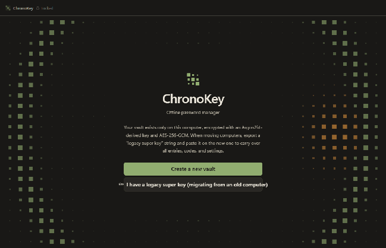

# ChronoKey（时钥）

纯本地、离线的密码管理器。Windows / macOS / Linux 三平台——同一份保险库文件和历史超密钥在三个系统之间通用,中间没有任何云。

[中文](README.zh.md) · [English](README.md)

<p align="center">
  
</p>

<p align="center">
  
</p>

## 特性

### <svg width="16" height="16" viewBox="0 0 16 16" aria-hidden="true"><path d="M2.5 8.5l3.5 3.5 7-8" fill="none" stroke="#4c9a63" stroke-width="2" stroke-linecap="round" stroke-linejoin="round"/></svg> 已完成

- **纯本地加密存储** — 所有数据存储在本地，使用 Argon2id + AES-256-GCM 加密
- **加密附件** — 任何条目都可以挂文件（单文件 5 MB、整库 25 MB），随保险库一起加密;超大附件按设计不写入纯文本格式的超密钥
- **系统托盘与全局热键** — 可选关闭窗口驻留托盘（托盘菜单:打开/锁定/退出），`Ctrl+Shift+K` 在任何应用最前面唤出/隐藏窗口
- **浏览器扩展（Beta）** — 配套扩展（仓库 `extension/` 目录，开发者模式加载）通过可选的令牌鉴权 127.0.0.1 桥为当前网站回填登录项;保险库锁定的瞬间桥里一无所有
- **历史超密钥** — 将整个密码库和设置导出为一个密钥字符串，可在新电脑上粘贴导入
- **双因素认证 (2FA/TOTP)** — 内置 RFC 6238 TOTP 生成器，支持 QR 码扫描和 otpauth URI
- **密码生成器** — 随机密码、口令短语、PIN 码，使用密码学安全的随机源
- **强度评估** — 实时检测弱密码、字典词、键盘序列和常见模式
- **安全审计** — 扫描弱密码、重复密码、缺少 2FA 的账户
- **多种条目类型** — 登录、TOTP、信用卡、身份、地址、笔记、API 密钥、SSH 密钥
- **SSH 密钥生成** — 生成 OpenSSH ed25519 密钥对
- **版本历史** — 每个条目保留最多 15 个历史版本，可回滚
- **废纸篓** — 软删除，可恢复或一键清空
- **文件夹组织** — 自定义文件夹，右键或双击重命名
- **标签系统** — 多标签分类
- **全文搜索** — 快速查找（密钥字段不参与搜索，保护隐私）
- **导入导出** — 支持 CSV、Bitwarden JSON、KeePass XML、ChronoKey JSON
- **恢复代码** — 25 字符 Crockford base32 编码的恢复密钥
- **自动锁定** — 闲置、睡眠、锁屏时自动锁定
- **剪贴板保护** — 敏感内容复制后自动清除（默认 20 秒）
- **便携模式** — 程序旁放置 `ChronoKeyData` 文件夹即可实现数据便携
- **重置保险库** — 忘记主密码和恢复代码时，可删除当前保险库重新开始
- **深浅色主题** — 跟随系统或手动切换
- **多语言界面 (i18n)** — 内置简体中文、English、Русский；另有 13 种语言包（Deutsch、Français、Español、Português、Italiano、Nederlands、Polski、Українська、Türkçe、日本語、한국어、Tiếng Việt、Bahasa Indonesia）放在仓库 `locales/` 目录：在安装程序里选好语言即可与程序一起下载，也可手动把语言包放进程序旁的 `locales/` 文件夹。在「设置 → 外观」中切换，已安装的语言都会列在那里
- **Window Controls Overlay** — Windows 11 原生标题栏按钮，支持贴靠布局
- **完全离线** — 程序不请求任何网络权限，防火墙完全断网运行

### <svg width="16" height="16" viewBox="0 0 16 16" aria-hidden="true"><circle cx="8" cy="8" r="6" fill="none" stroke="#E2943B" stroke-width="1.5"/><path d="M8 4.5v3.5l2.2 1.6" fill="none" stroke="#E2943B" stroke-width="1.5" stroke-linecap="round"/></svg> 计划中

以下功能暂未实现：

- 浏览器扩展自动填充
- Windows Hello / Touch ID / 生物识别解锁
- YubiKey / 硬件密钥支持
- Shamir 秘密共享恢复
- 命令行工具 (CLI)
- 插件系统
- Passkey (WebAuthn)

## 设计理念

### 无服务器架构

ChronoKey **不需要**也**不提供**任何服务器功能：

- <svg width="14" height="14" viewBox="0 0 16 16" aria-hidden="true"><path d="M4 4l8 8M12 4l-8 8" fill="none" stroke="#b54434" stroke-width="2" stroke-linecap="round"/></svg> 无云同步
- <svg width="14" height="14" viewBox="0 0 16 16" aria-hidden="true"><path d="M4 4l8 8M12 4l-8 8" fill="none" stroke="#b54434" stroke-width="2" stroke-linecap="round"/></svg> 无多设备自动同步
- <svg width="14" height="14" viewBox="0 0 16 16" aria-hidden="true"><path d="M4 4l8 8M12 4l-8 8" fill="none" stroke="#b54434" stroke-width="2" stroke-linecap="round"/></svg> 无在线泄露监控 (HIBP)
- <svg width="14" height="14" viewBox="0 0 16 16" aria-hidden="true"><path d="M4 4l8 8M12 4l-8 8" fill="none" stroke="#b54434" stroke-width="2" stroke-linecap="round"/></svg> 无共享密码库
- <svg width="14" height="14" viewBox="0 0 16 16" aria-hidden="true"><path d="M4 4l8 8M12 4l-8 8" fill="none" stroke="#b54434" stroke-width="2" stroke-linecap="round"/></svg> 无团队协作
- <svg width="14" height="14" viewBox="0 0 16 16" aria-hidden="true"><path d="M4 4l8 8M12 4l-8 8" fill="none" stroke="#b54434" stroke-width="2" stroke-linecap="round"/></svg> 无账号系统
- <svg width="14" height="14" viewBox="0 0 16 16" aria-hidden="true"><path d="M4 4l8 8M12 4l-8 8" fill="none" stroke="#b54434" stroke-width="2" stroke-linecap="round"/></svg> 无订阅验证
- <svg width="14" height="14" viewBox="0 0 16 16" aria-hidden="true"><path d="M4 4l8 8M12 4l-8 8" fill="none" stroke="#b54434" stroke-width="2" stroke-linecap="round"/></svg> 无在线更新检查

多设备使用通过**手动文件同步**实现：

- USB 闪存盘
- Syncthing
- 云盘文件夹 (OneDrive/iCloud/Dropbox)
- 历史超密钥复制粘贴

### 安全设计

**加密方案：**

- **密钥派生**: Argon2id (m=65536 KiB, t=3, p=1)
- **主密码**: 最低 10 字符，强度分数 ≥ 2/4
- **数据加密**: AES-256-GCM + AAD 绑定上下文
- **密钥包装**: 随机 32 字节 DEK，分别用主密码和恢复代码包装
- **恢复代码**: 25 字符 Crockford base32，离线存储

**Electron 安全：**

- `contextIsolation`: true
- `sandbox`: true
- `nodeIntegration`: false
- CSP: `connect-src 'none'`
- 所有网络请求被 `webRequest.onBeforeRequest` 拦截
- 内容保护 (截屏录屏保护)
- 主进程持有 DEK，渲染进程永远看不到

**威胁模型边界（诚实安全声明）：**

<svg width="16" height="16" viewBox="0 0 16 16" aria-hidden="true"><path d="M2.5 8.5l3.5 3.5 7-8" fill="none" stroke="#4c9a63" stroke-width="2" stroke-linecap="round" stroke-linejoin="round"/></svg> **保护：**

- 磁盘窃取 (文件已加密)
- 网络窃听 (无网络通信)
- 恶意网站 / 浏览器漏洞 (沙箱隔离)
- 剪贴板残留 (自动清除)
- 屏幕截图 / 录屏 (内容保护)

<svg width="16" height="16" viewBox="0 0 16 16" aria-hidden="true"><path d="M4 4l8 8M12 4l-8 8" fill="none" stroke="#b54434" stroke-width="2" stroke-linecap="round"/></svg> **不保护：**

- 操作系统级别的恶意软件 (键盘记录器、内存扫描)
- 物理访问时的冷启动攻击
- 用户选择弱主密码
- 恢复代码物理泄露
- 未经审计的代码 (本项目未经第三方安全审计)

### 历史超密钥格式

格式： `CK1.<base64url(header + iv + tag + ciphertext)>.<crc32>`

**头部 (27 字节)：**

```
CKSK             魔数 (4 字节)
0x01             版本 (1 字节)
m,t,p            Argon2id 参数 (6 字节 u32 + u8 + u8)
salt             盐 (16 字节)
```

**载荷 (gzip)：**

```json
{
  "app": "ChronoKey",
  "kind": "history-super-key",
  "version": 1,
  "exportedAt": "2026-10-01T00:00:00.000Z",
  "data": { ... }
}
```

**合并规则：**

- 同 ID 条目： 较新 `updatedAt` 胜出
- 旧版本进入 `versions` 数组
- 文件夹、标签并集
- 审计日志追加

## 快捷键

| 按键 | 功能 |
|------|------|
| `Ctrl/⌘ + F` | 聚焦搜索框 |
| `Ctrl/⌘ + K` | 聚焦搜索框 (备选) |
| `Ctrl/⌘ + N` | 新建条目 |
| `Ctrl/⌘ + L` | 锁定密码库 |
| `Ctrl/⌘ + ,` | 打开设置 |
| `Ctrl/⌘ + G` | 打开密码生成器 |
| `Ctrl/⌘ + S` | 保存条目 (编辑器中) |
| `Esc` | 关闭模态框 |
| `↑/↓` | 列表导航 |

## 构建与运行

### 开发模式

```bash
npm install
npm run dev        # 启动 Vite 开发服务器 (http://localhost:5173)
```

在另一个终端：

```bash
npm run electron:dev
```

或在浏览器中访问 http://localhost:5173 （使用演示数据，密码 "demo"）。

### 测试

```bash
npm test           # 运行所有单元测试
npm run test:electron  # Electron 集成测试
```

### 打包

```bash
npm run dist       # 构建 Windows x64 便携 zip: release/ChronoKey-<版本>-win-x64.zip
```

### 安装程序 (ChronoKeySetup.exe)

`installer/` 是一个小型在线安装 / 卸载程序（WinForms，.NET Framework 4.8，Windows 10/11 自带）：

1. 选择安装位置（默认 `%LOCALAPPDATA%\Programs\ChronoKey`，无需管理员权限）
2. 从 GitHub Releases 下载 `latest.json` 指向的 zip，显示进度、速度与剩余时间
3. 校验 SHA-256，解压，创建开始菜单 / 桌面快捷方式，写入"已安装的应用"卸载项
4. 在首屏选择应用界面语言：内置简体中文 / English / Русский，其他语言按 `languages.json` 清单与程序一起下载，装入 `locales\`
5. 点击"完成"后安装程序删除自身；安装目录中的 `Uninstall.exe` 用于卸载（可选择保留保险库数据）

构建： 运行 `installer\build.cmd`（使用系统自带的 csc，无需 SDK）。图标由 `installer/MakeIcon.cs` 生成。

### 平台支持

- **Windows** x64 —— 安装程序（自动选择界面语言）或便携版 zip
- **macOS** x64 / Apple silicon —— zip 与 dmg,**未签名**:首次启动右键 → 打开,或执行 `xattr -cr /Applications/ChronoKey.app`（签名接入见 docs/SIGNING.md）
- **Linux** x64 —— AppImage 与 deb;托盘功能需要支持 appindicator 的桌面环境
- Mac/Linux 构建在发布时由 CI 在真实 runner 上产出,且**每个平台都先跑完单元测试与完整 Electron 冒烟**才上传产物;把主保险库托付之前仍建议先试用

### 便携模式

在程序同目录下创建 `ChronoKeyData` 文件夹，数据将保存在该文件夹而非用户目录。适合 USB 闪存盘使用。

## 技术栈

- **Electron** 44.5.1
- **React** 19.3.0
- **Vite** 8.3.1
- **hash-wasm** 4.12.0 (Argon2id)
- **jsQR** 1.4.0
- **electron-builder** 26.15.3

## 配色方案

"Washi × Moss" 来自 [NIPPON COLORS](https://nipponcolors.com)：

- 柳染 #91AD70 (主色)
- 苔 #838A2D
- 紅樺 #B54434 (危险/警告)
- 朽葉 #E2943B
- 利休白茶 #B4A582
- 砥粉 #D7B98E
- 墨 #1C1C1C

所有文字对比度 ≥ 4.5:1 (WCAG AA)

## 关于开源加密代码

加密部分（`electron/crypto.cjs`、`electron/vault.cjs`）**完整开源**，这是有意为之：

- 只使用公开、经过审计的标准算法： Argon2id (RFC 9106)、AES-256-GCM、系统 CSPRNG，没有自创算法
- 代码中不含任何密钥、后门或"秘密参数"；保险库的安全只取决于你的主密码和恢复代码
- 依据 Kerckhoffs 原则，公开实现不会降低安全性，反而让任何人都能审查是否存在漏洞；闭源的密码管理器无法被验证

需要保密的只有你的主密码、恢复代码和超密钥口令，它们从不离开你的电脑。发现安全问题请通过 GitHub 私下报告（Security → Report a vulnerability），不要公开提 issue。

## 许可证

MIT License — 详见 [LICENSE](LICENSE)

## 鸣谢

- [EFF Large Wordlist](https://www.eff.org/deeplinks/2016/07/new-wordlists-random-passphrases) (口令短语)
- [NIPPON COLORS](https://nipponcolors.com) (配色灵感)
- Electron 团队与 Anthropic Claude

---

**安全声明**: 本项目未经第三方安全审计。密码管理器应在理解其威胁模型的前提下使用。如发现安全问题，请负责任地披露。
